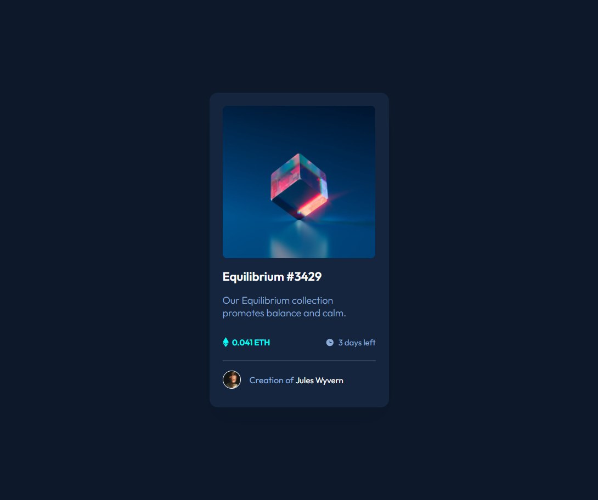

 Frontend Mentor - NFT preview card component solution

This is a solution to the [NFT preview card component challenge on Frontend Mentor](https://www.frontendmentor.io/challenges/nft-preview-card-component-SbdUL_w0U). Frontend Mentor challenges help you improve your coding skills by building realistic projects. 

## Table of contents

- [Overview](#overview)
  - [The challenge](#the-challenge)
  - [Screenshot](#screenshot)
  - [Links](#links)
- [My process](#my-process)
  - [Built with](#built-with)
  - [What I learned](#what-i-learned)
  - [Continued development](#continued-development)
  - [Useful resources](#useful-resources)
- [Author](#author)

## Overview
An NFT card created using only HTML and CSS.

### The challenge

Users should be able to:

- View the optimal layout depending on their device's screen size
- See hover states for interactive elements

### Screenshot



### Links

- Solution URL: [https://github.com/mashaw22/NFT-Card](https://github.com/mashaw22/NFT-Card)
- Live Site URL: [Add live site URL here](https://your-live-site-url.com)

## My process

### Built with

- Semantic HTML5 markup
- CSS custom properties
- Flexbox
- Mobile-first workflow

### What I learned

I was most proud of changing the color when hovering over the NFT image.

```css
.card-img {
    background-image: url('./images/image-equilibrium.jpg');
    background-position: center;
    background-size: cover;
    background-color: hsl(178, 100%, 50%);
}
.container:hover .card__img {
    opacity: 0.5;
    background-blend-mode: luminosity;
    cursor: pointer;
}
```

### Continued development

When hovering over the NFT image, the background color isn't the same cyan as in the Figma file. This will be something that I can work on later.


### Useful resources

- [W3 Schools: How to - Image Hover Overlay](https://www.w3schools.com/howto/howto_css_image_overlay.asp) - This helped me use an ease transition for the hover effect.
- [W3 Schools: CSS background-image Property](https://www.w3schools.com/cssref/pr_background-image.asp) - This article helped me to remember how to use an image as a background in CSS instead of placing it in the HTML.


## Author

- Website - [Samantha Neely](https://samanthaneely.me)
- Frontend Mentor - [@mashaw22](https://www.frontendmentor.io/profile/mashaw22)
